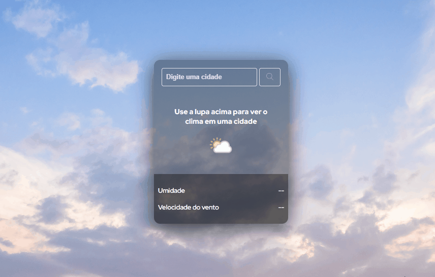

# App de Previsão do Tempo

Este é um aplicativo simples de previsão do tempo que permite aos usuários verificar as condições climáticas atuais de uma cidade específica.

## Funcionalidades

- **Busca por cidade:** Os usuários podem digitar o nome de uma cidade na caixa de busca e clicar no botão de busca para obter as informações climáticas dessa cidade.
- **Exibição das informações:** O aplicativo exibe informações como temperatura, condição climática, umidade e velocidade do vento.
- **Ícone de condição climática:** Um ícone representativo da condição climática atual da cidade é exibido junto com as informações.

## Tecnologias Utilizadas

- HTML
- CSS
- JavaScript
- API do WeatherAPI

## Como Usar

1. Clone este repositório para o seu ambiente local.
2. Abra o arquivo `index.html` em seu navegador da web.
3. Digite o nome da cidade desejada na caixa de busca.
4. Clique no botão de busca.
5. As informações climáticas da cidade serão exibidas na tela.

## API Utilizada

Este aplicativo utiliza a API do WeatherAPI para obter as informações climáticas. É necessário ter uma chave de API válida para utilizar este aplicativo. Você pode obter uma chave de API em [WeatherAPI](https://www.weatherapi.com/).

## Autor

Desenvolvido por [Alberes P. Nascimento](https://github.com/Alberesbass).

## Licença

Este projeto está licenciado sob a Licença MIT - consulte o arquivo [LICENSE](LICENSE) para mais detalhes.
